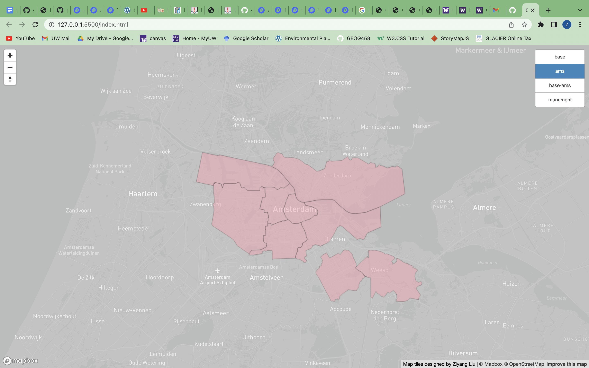

# Amsterdam_Monuments Web_map&tile_generation
This project creates a web-baesd map depicting the boundary of City of Amsterdam and the location of monuments. To ensure timely loading, we create the map with tiles. In this project, we generate tiles with two methods. The first method import map layers to QGIS and use QMetaTiles, a plugin in QGIS, to generate tiles. The second method use Mapbox studio. Mapbox studio can generate and host tiles, users can simply insert the tiles link in their codes to load tiles on their webpage, with mapbox gl js api. Follow the link to access the map: https://jerryliu-96.github.io/web_map_tile_generation/

## Tilesets and Zoom level
This map contains four tilesets. The first tile set is the base map of the City of Amsterdam, referred as "base" in the map; and the second tileset delineates the boundary of each district of City of Amsterdam, referred as "ams" in the map; and the third tileset is the combined tiles of base map and district boundaries, referred as "base-ams" in the map;  The fourth tileset is the monument tileset, each point represents a statue, referred as "base" in the map; First three tilesets are rasters, and the last tileset is vector. All these four tile sets can be controlled by a toggle on the top right of the map.
 
 
 
 

The available zoom level for tileset "base", "ams", "base-ams" are from level 1 to level 14. This parameter can be set in QGIS QMetaTiles plugin, and the "monument" layer is controlled by Mapbox studio. The zoom level can be controlled by a scale bar on the top left of the map.

The examined geographical area is Amsterdam along with its suburban area.